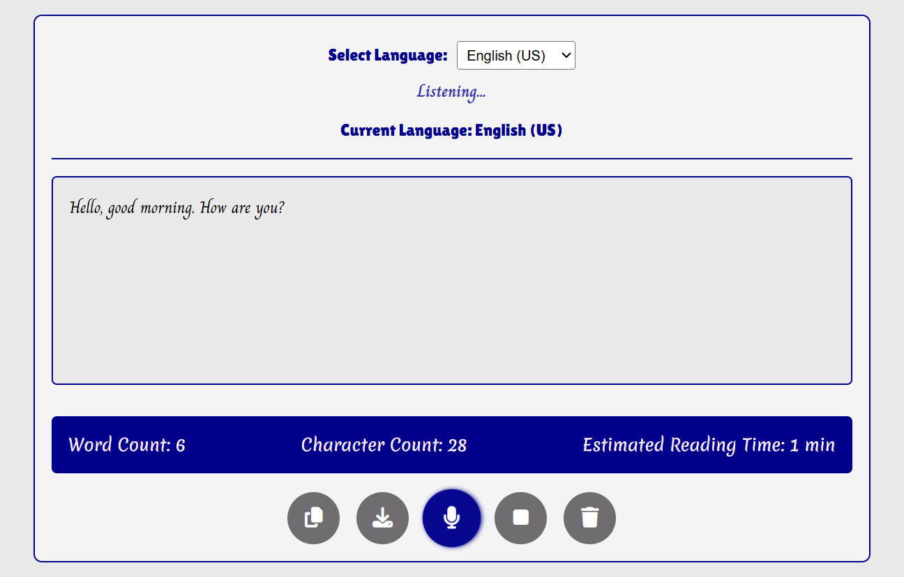

# 🎤 Speech to Text Converter

This is a simple web-based Speech to Text Converter built using JavaScript and the Web Speech API. It allows users to transcribe speech in real time, select different recognition languages, and download or copy their transcriptions.



## 🌟 Features

- 🎙️ Start/Stop voice recognition
- 🌍 Language selection (supports multiple languages)
- 💾 Download transcript as `.txt` file
- 📋 Copy transcript to clipboard
- 🧹 Clear transcript
- 🔢 Real-time word, character count, and estimated reading time
- 💡 Persists selected language using `localStorage`
- 📌 Displays active recognition language

## 🚀 Getting Started

### Prerequisites

- A modern web browser (Chrome recommended)
- Internet connection (for browser speech recognition support)

### Installation

1. Clone the repository:

   ```bash
   git clone https://github.com/paulmagadi/speech-to-text-converter.git
   cd speech-to-text-converter

Open index.html in your browser:

## 📁 Project Structure

```
speech-to-text-converter/
│
├── index.html         # Main application HTML
├── style.css          # Custom styles 
├── script.js          # Main JavaScript logic
└── README.md          # Project documentation
```

## 🧪 Browser Support
This app uses **webkitSpeechRecognition**, which is supported in:

- Google Chrome (Desktop only)

- Edge (Chromium-based)

**⚠️ Not supported in Firefox, Safari, or mobile browsers.**

## 📜 License
This project is open source and available under the MIT License.

## ✨ Demo
Want to try it out? Visit [Live Demo](https://paulmagadi.github.io/speech-to-text-converter)

## Built with 💻 + 🎤 by *Paul Magadi*